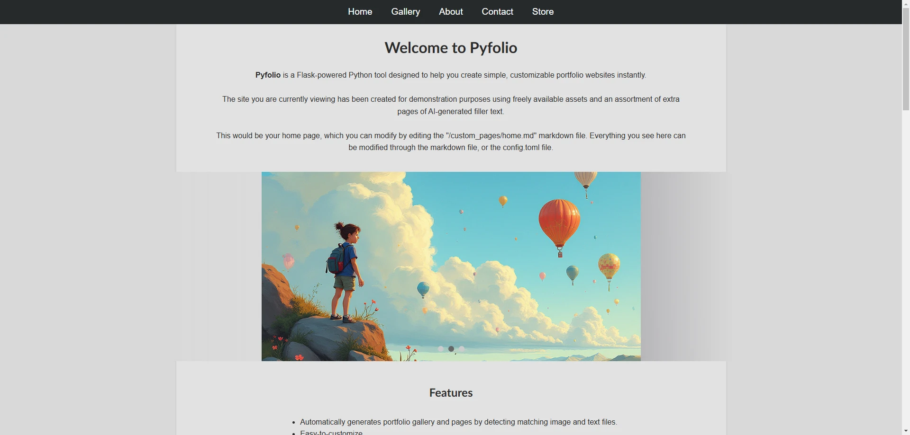
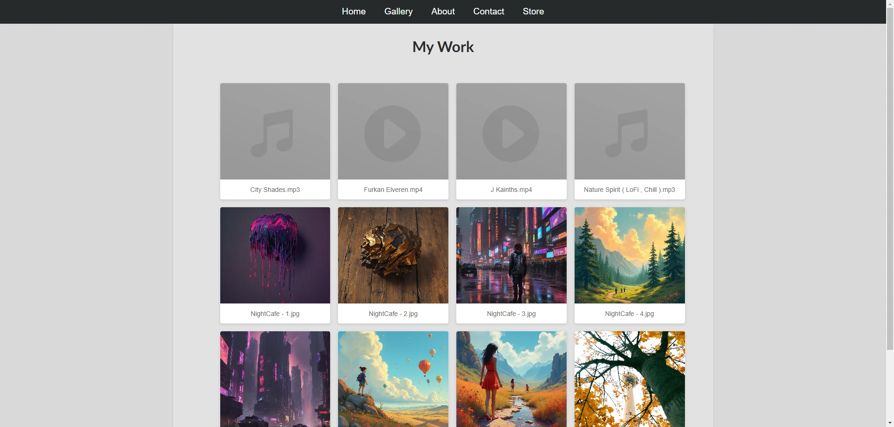

# Pyfolio - Easy Portfolio Websites

**Pyfolio** is a Python-based tool, powered by Flask, designed to help you create simple, customizable portfolio websites effortlessly.

This tool automatically generates a portfolio gallery and pages by detecting matching image, audio and video files and text files. Pyfolio can also bake a static version of your site instead of running as a web app, ready to be hosted on any web hosting service.

You can try a demo at the following:

Web app demo : https://lightbringer777.pythonanywhere.com/

Static site demo: https://classy-taffy-5d54dc.netlify.app/

<p align="center">
  <a href="https://raw.githubusercontent.com/JeanMariePrevost/pyfolio/refs/heads/main/images/screenshot_demo_home.webp">
    
  </a>
  &nbsp;&nbsp;&nbsp; <!-- Adds spacing between images -->
  <a href="https://raw.githubusercontent.com/JeanMariePrevost/pyfolio/refs/heads/main/images/screenshot_demo_gallery.webp">
    
  </a>
</p>


---

## Features
- **Automated Portfolio Gallery**: Automatically pairs images, audio, or video files with matching text content.
- **Customizable and Flexible**: Easily edit layouts and add content through Markdown and configuration files.
- **Static Site Generation**: Option to bake a static version of your portfolio for hosting on any server.

---

## Getting Started

### 1. Add Your Files
Place your images, audio, and video files in the `/portfolio/` directory.

### 2. Customize Portfolio Item Pages
For any asset, add a Markdown file with the same name to include additional content.  
Example:  
`/portfolio/my_picture.jpg` → `/portfolio/my_picture.md`

### 3. Create or Modify Pages
To add or edit pages, work with the Markdown files in `/custom_pages/`.  
Example:  
`/custom_pages/about.md` creates a new "About" page.

### 4. Define Navigation and Footer Links
Edit the `config.toml` file to configure links for the navigation bar and footer.  
Example for a top navigation link:
```
[[top_link]]
label = "Portfolio"
target = "portfolio.md"
```
Example for a footer link:
```
[[footer_link]]
label = "Privacy Policy"
target = "privacy.md"
```

### 5. Run Pyfolio
To start the Pyfolio server:
```bash
python app.py
```
To generate a static version of your portfolio:
```bash
python bake_website.py
```
The static site will be saved in `/bake_website_output/`.

### 6. View Your Portfolio
- **Local Server**: Open your browser at `http://localhost:5000`.
- **Static Site**: Open `index.html` in `/bake_website_output/`.
- **Deployment**: Host Pyfolio on platforms like Heroku, pythonanywhere, or your own server.

---

## Markdown Quickstart for Custom Pages

### Basic Syntax
```markdown
# Heading 1
## Heading 2
### Heading 3

- Bullet point 1
- Bullet point 2

**Bold text**, _italic text_, and [link text](https://example.com)
```

### Images
```markdown

```

### Links
Internal pages:
```markdown
[About Page](about)
```
External links:
```markdown
[Google](https://www.google.com)
```

---

## Special Pyfolio Features

### Carousel
Showcase a random selection of your images:
```
{{pyfolio-carousel}}
```

### Gallery
Display a grid of all portfolio items:
```
{{pyfolio-gallery}}
```

These tags render dynamic, interactive content when placed in your Markdown files.

---

## License
Pyfolio is open-source software licensed under the MIT License. You are free to use, modify, and distribute it, subject to the terms of the license.